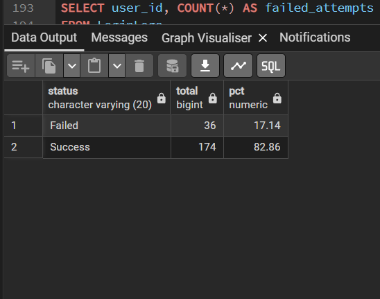
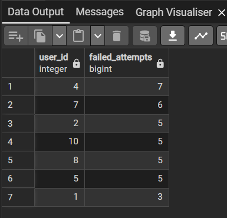
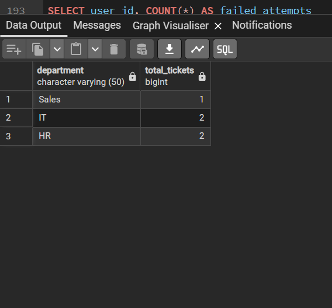

# SQL Data Analysis Project

## Overview
Built a relational database to analyze authentication activity and system performance across a simulated IT environment.

## Data Scale
- 210+ login records
- 10 users
- 3 structured tables (Users, LoginLogs, Tickets)

## Key Results
- Reduced authentication failure rate from **30.5% → 17.1%**
- Increased success rate to **82.9%**
- Identified users with highest failed login attempts
- Analyzed ticket distribution across departments

## Queries Used
- SELECT
- WHERE
- JOIN
- GROUP BY
- COUNT

## Visual Results

### Login Success vs Failure

### Failed Login Analysis

### Tickets by Department

